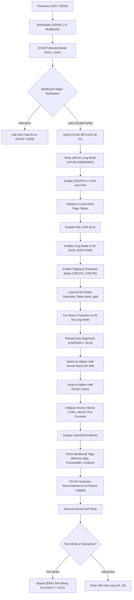

# LlamaOS/A System Architecture

## 1. Architectural Philosophy

LlamaOS/A is designed from first principles as an x86-64 operating system emphasizing:
1. **Strong Boundaries**: Clean separation between architecture-specific low-level code, core kernel abstractions, device drivers, and userland.
2. **Deterministic Execution**: Zero hidden allocations, deterministic error handling, and robust diagnostic panic paths.
3. **Memory Safety & Privilege Enforcement**: Strict higher-half kernel design, non-executable stacks, and early preparation for hardware privilege separation (Ring 0 / Ring 3).
4. **Continuous Testability**: Automated execution testability in emulators (QEMU) and physical hardware.

---

## 2. Memory Architecture

### 2.1 Virtual Address Space Layout (x86-64 Canonical 48-bit)

x86-64 utilizes canonical 48-bit virtual addressing where bits 47 to 63 must be sign-extended. LlamaOS/A partitions this address space into User Space (Lower Half) and Kernel Space (Higher Half):

```
+----------------------------------+ 0xFFFFFFFFFFFFFFFF
|  Kernel Higher-Half (-2 GiB)     | (Kernel Code, Data, BSS, Stack, Early Devices)
+----------------------------------+ 0xFFFFFFFF80000000 (KERNEL_VIRTUAL_BASE)
|  Dynamic Kernel Heap / VMM       | (Subsequent Memory Management Phases)
+----------------------------------+ 0xFFFF800000000000
|  Non-Canonical Address Hole      | (Addresses with inconsistent bit 47..63)
+----------------------------------+ 0x00007FFFFFFFFFFF
|  User-Space Virtual Memory       | (User processes, heaps, stacks, mmap)
+----------------------------------+ 0x0000000000000000
```

### 2.2 Kernel Code Model (`-mcmodel=kernel`)
The kernel is compiled with GCC's `-mcmodel=kernel` flag:
- All symbols are linked in the top 2 GiB range `[0xFFFFFFFF80000000, 0xFFFFFFFFFFFFFFFF]`.
- Memory references use 32-bit sign-extended immediate displacement, generating compact and efficient machine code without 64-bit pointer indirection overhead.
- Relocations do not clobber user-space canonical virtual ranges (`0x0000000000000000` to `0x00007FFFFFFFFFFF`).

### 2.3 Early Boot Paging Hierarchy
During early bootstrap (`boot.asm`), the 32-bit transition routine sets up a 4-level page table hierarchy mapping 2 GiB of physical memory:
- **PML4 Index 0**: Identity-maps the first 1 GiB (`0x00000000` - `0x3FFFFFFF`) using 2 MiB large pages. This ensures instruction fetch continuity while the instruction pointer (`EIP/RIP`) resides at physical load address `0x00100000`.
- **PML4 Index 511**: Higher-half maps the top 512 GiB.
  - **PDPT Index 510**: Maps `0xFFFFFFFF80000000` - `0xFFFFFFFFBFFFFFFF` (first 1 GiB of physical RAM) using 2 MiB large pages (`0x83`: Present, Writable, PageSize).
  - **PDPT Index 511**: Maps `0xFFFFFFFFC0000000` - `0xFFFFFFFFFFFFFFFF` (second 1 GiB of physical RAM) using 2 MiB large pages.

Once full virtual memory management (Phase 3) is initialized, PML4 Index 0 is unmapped to catch null-pointer dereferences in user and kernel space immediately.

---

## 3. Boot Sequence and State Machine



---

## 4. Subsystem Layout

1. **`kernel/arch/x86_64/`**:
   - `boot/`: Multiboot2 header definition, 32-to-64 bit assembly trampoline, page table builder, tag stream parser.
   - `cpu/`: Low-level port I/O (`inb`/`outb`), Model-Specific Registers (`rdmsr`/`wrmsr`), CPUID hardware feature detection.
   - `linker.ld`: Higher-half linker script separating code (`.text`), read-only data (`.rodata`), data (`.data`), and zero-initialized state (`.bss`).

2. **`kernel/core/`**:
   - `types.hpp`: Freestanding fixed-width integers (`uint8_t` through `uint64_t`, `size_t`, `uintptr_t`).
   - `string.hpp`/`string.cpp`: Memory manipulation (`memset`, `memcpy`, `memmove`, `memcmp`) and string operations.
   - `kprint.hpp`/`kprint.cpp`: Formatted printing (`kprintf`, `klog`) with color-coded severity levels.
   - `panic.hpp`/`panic.cpp`: Deterministic kernel panic with register dump and debug-exit trigger.
   - `runtime.cpp`: Freestanding C++ runtime support (`__cxa_pure_virtual`, `__cxa_atexit`, stack canary).

3. **`kernel/drivers/`**:
   - `serial.hpp`/`serial.cpp`: 16550 UART driver on COM1 (`0x3F8`) and debug port `0xE9`.
   - `vga.hpp`/`vga.cpp`: Standard 80x25 text console with colors, scrolling, and CRTC cursor tracking.

4. **`boot/grub/`**:
   - `grub.cfg`: GRUB configuration providing automated test boot, standard interactive boot, and debug boot.

5. **`scripts/`**:
   - `build.sh`: Consolidated build script.
   - `run_qemu.sh`: QEMU launch helper supporting BIOS, UEFI, GDB server, and test exit.
   - `test_boot.py`: Autonomous boot test harness verifying banner and assertion tokens.

---

## 5. Security & Safety Model

- **Non-Executable Stack**: Linked with `-z noexecstack` and `.note.GNU-stack` to ensure code execution on stack pages is prohibited.
- **Stack Smashing Protection**: Compiled with `-fstack-protector-strong` with runtime canary validation (`__stack_chk_guard`).
- **No Red-Zone**: Kernel compiled with `-mno-red-zone` to protect the stack from being clobbered by asynchronous interrupts.
- **Strict Pointer and Range Checking**: All physical-to-virtual translations and tag parsing validate bounds and sizes.
